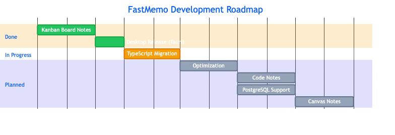

<h1 align="center">
  
   
  Roadmap
</h1>

  <a href="#overview">Overview</a> •
  <a href="#timeline">Timeline</a> •
  <a href="#features">Features</a>

---

## Overview

| Done | In Progress | Planned | Total |
| :--: | :---------: | :-----: | :---: |
|  1   |      1      |    4    |   6   |

---

## Timeline

  

---

## Features

### Kanban Board Notes

|                 |                                                                                                        |
| --------------- | ------------------------------------------------------------------------------------------------------ |
| **Status**      | Done                                                                                                   |
| **Description** | Note management with Kanban boards. Organize tasks and ideas in customizable columns with drag & drop. |

---

### Desktop Release (Tauri)

|                 |                                                              |
| --------------- | ------------------------------------------------------------ |
| **Status**      | In Progress                                                  |
| **Description** | Native desktop app for Windows, macOS and Linux using Tauri. |
| **Goals**       | Multi-platform builds, auto-updates, offline access.         |

---

### TypeScript Migration

|                 |                                                                                                    |
| --------------- | -------------------------------------------------------------------------------------------------- |
| **Status**      | Planned                                                                                            |
| **Description** | Full migration to TypeScript and component reorganization for better code quality and performance. |
| **Goals**       | Type safety, cleaner architecture, improved maintainability.                                       |

---

### Code Notes

|                 |                                                                   |
| --------------- | ----------------------------------------------------------------- |
| **Status**      | Planned                                                           |
| **Description** | Notes with syntax highlighting and code snippets support.         |
| **Goals**       | Multi-language highlighting, reusable snippets, Gist integration. |

---

### PostgreSQL Support

|                 |                                                                                       |
| --------------- | ------------------------------------------------------------------------------------- |
| **Status**      | Planned                                                                               |
| **Description** | PostgreSQL as an alternative to Firebase. Users can choose where to store their data. |
| **Goals**       | Self-hosting option, data migration tools, full data ownership.                       |

---

### Canvas Notes

|                 |                                                                   |
| --------------- | ----------------------------------------------------------------- |
| **Status**      | Planned                                                           |
| **Description** | Infinite canvas for visual notes, diagrams and freehand sketches. |
| **Goals**       | Zoomable canvas, drawing tools, shapes, export to PNG/SVG.        |
